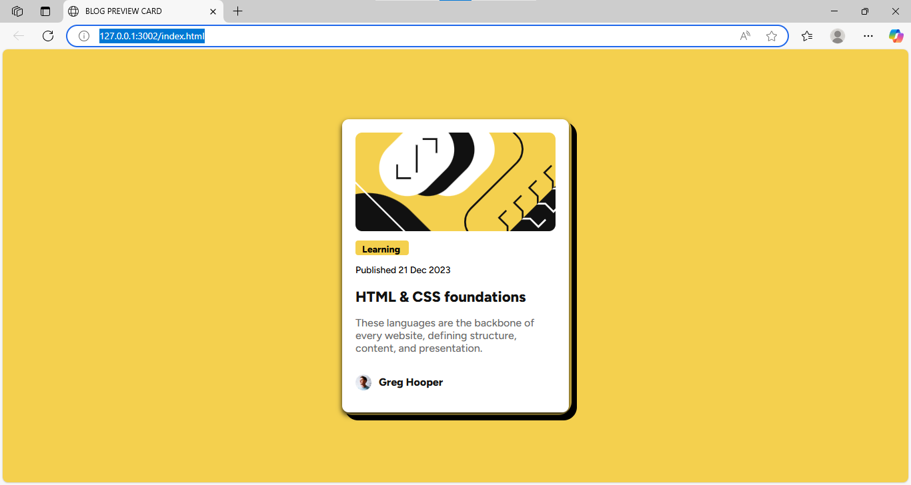

##  Blog Preview Card 
A responsive and accessible blog preview card built with HTML and CSS. This project follows a modern UI layout, featuring a featured image, category label, article title, summary, author info, and a clean card design.

## Features
- Clean, card-based layout

- Responsive design for mobile and desktop (375px – 1440px)

- Featured image with rounded corners

- Stylish font using Figtree

- Dark border shadow effect, inspired by the original design

- Author section with profile image and name

## Live Demo
https://echo-script0.github.io/Blog-preview-card/

## Screenshot

## Technologies
HTML
CSS

## Author
Aisha Adeyemo